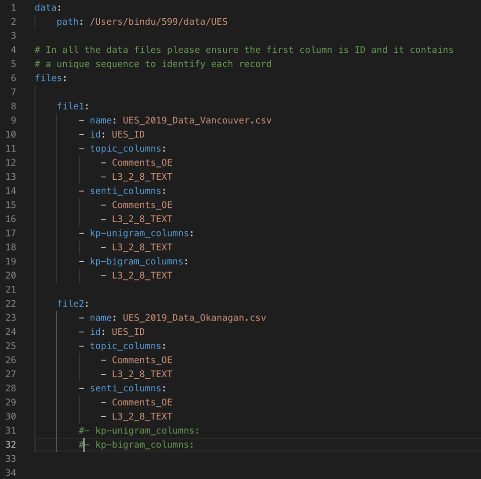
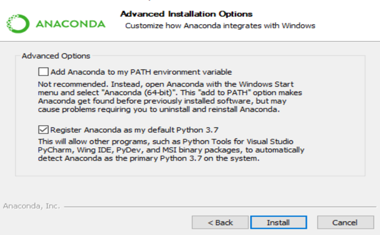
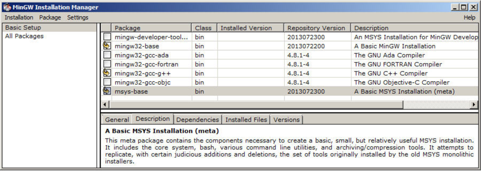
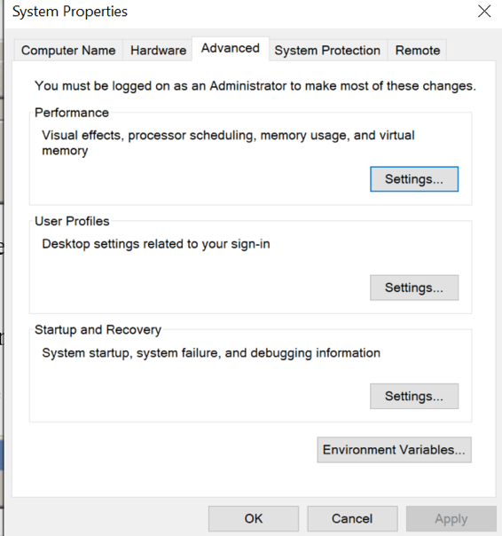
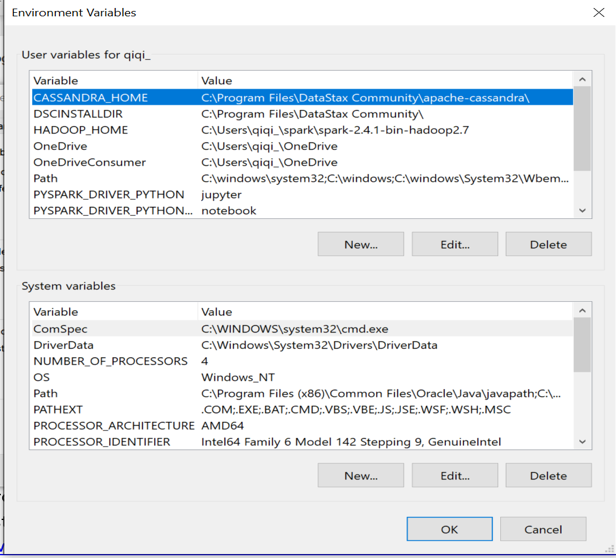
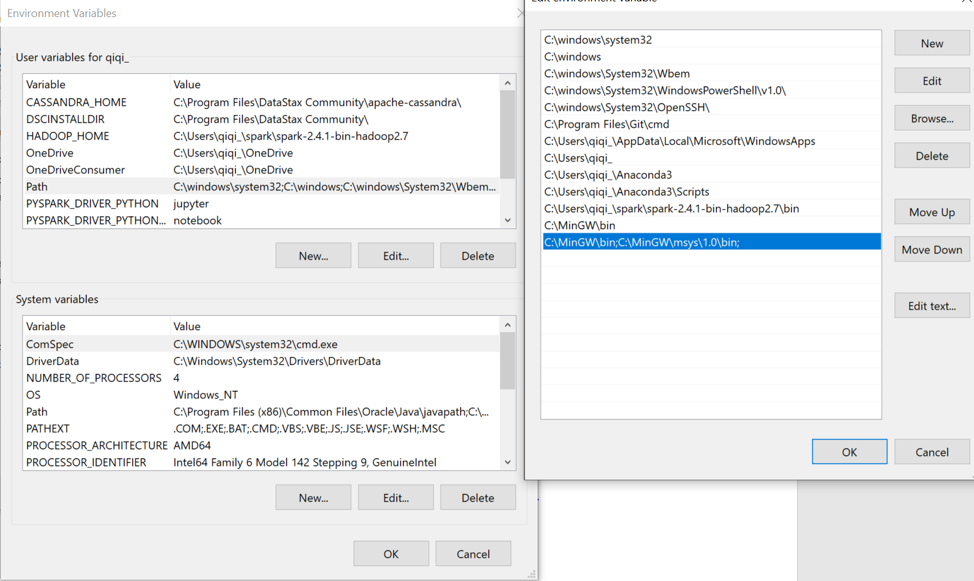
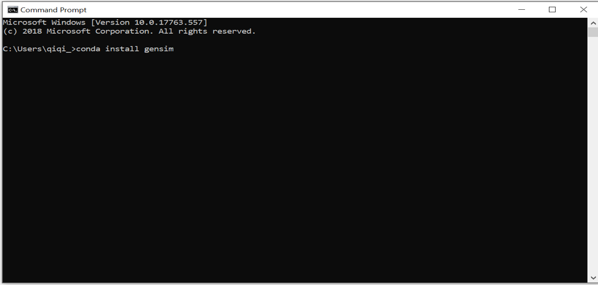
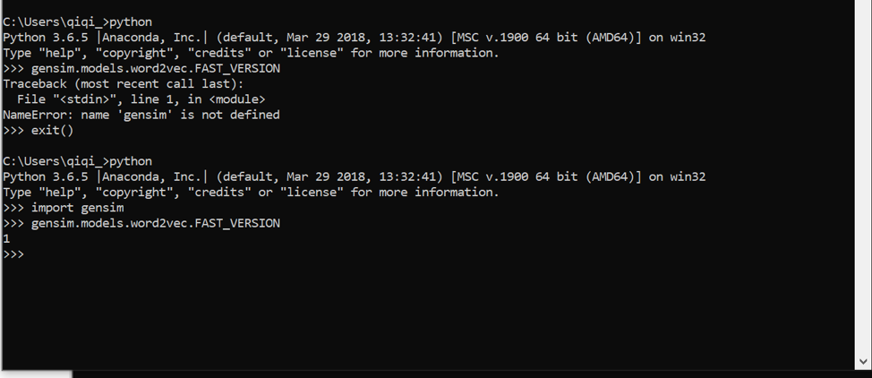
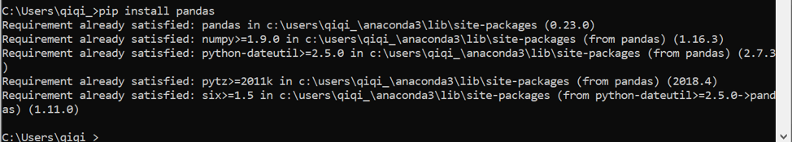

# UBC-PAIR-SurveyTextAnalysis

Please refer to the user guide and installation instructions

## User Guide

The main file to be edited is the `config.yml` file in the `config` folder.
It can be opened in any text editor like Notepad++, Atom etc.
It can be opened in notepad like a normal text file,
but the use of a better text editor is recommended to get a better sense of the indentation. 

The program can be executed for multiple columns in multiple data files at one go.
The only constraint is that all the data files should be located in the same folder/path.
The following are the main parts of the file which need to be edited according to the requirements:

1. **path:** (line 2 in the figure above) The path needs to be changed to the location of the folder containing the data files. All the data files should be put only in this folder.
2. **name:** (line 9 in the figure above) This is the name of the ‘csv’ file in which data is present.
3. **id:** (line 10 in the figure above) This is the id column in the above csv data file, it has to be a unique identifier of rows in the dataset. If a unique identifier is not present, please create it manually before running the code. 
4. **topic_columns:** (lines 12-13 in the figure above) Enter the column names from the above csv data file (one in each line) on which analysis needs to be performed. The results from the ‘topic categorization’ will be generated for these columns. This is suitable mainly for the descriptive questions (long responses in multiple sentences) where the students write about various aspects of their life at UBC.
5. **senti_columns:** (lines 15-16 in the figure above) Enter the column names from the above csv data file (one in each line) on which analysis needs to be performed. The results from the ‘sentiment analysis’ will be generated for these columns. This is suitable mainly for the descriptive questions (long responses in multiple sentences) where the students write about various aspects of their life at UBC, and their opinions might vary while writing about various aspects. If a column is entered here, both topic categorization and sentiment analysis will be performed as we are interested in how sentiments vary across various aspects.
6. **kp-unigram_columns:** (line 18 in the figure above) Enter the column names from the above csv data file (one in each line) on which analysis needs to be performed. The results from the ‘key-word analysis’ will be generated for these columns. This is suitable mainly for the fact-based questions where the responses are short (few words or one sentence) but can be run on any question. Results generated will show few important words in the responses.
7. **kp-bigram_columns:** (line 20 in the figure above) Enter the column names from the above csv data file (one in each line) on which analysis needs to be performed. The results from the ‘key-phrase analysis’ will be generated for these columns. This is suitable mainly for the fact-based questions where the responses are short (few words or one sentence) but can be run on any question. Results generated will show few important two-word phrases in the responses.

The above steps can be repeated for any number of files. As shown in the lines 22-32 in the above figure, the files can be added one after the other. 

**Note:** If some kind of analysis is not required for any question, the name of analysis can be commented out (by putting `#` in front of the line) as shown in the lines 31-32 in the figure above, or it can be removed completely. Commenting it out is recommended as it makes it easier to edit if the analysis is required later.

***Important: Add some data for training***: Please use historical and the current data to train the algorithm in order to develop the word clusters. To do this, simply add responses to open-ended questions in similar surveys in the `response` column in the `topic\full_data_train_word2vec.csv` file. More data is better. See screenshot below for sample. It is recommended to add cleaned text (lower case, without stop words, etc). Functions in `cleaning\cleaning.py` can be referred to for this purpose.

**Stop Words:** If any word(s) are not desired in the output or if they don't add any value to the output, they can be added to the `config/pair_stopwords.txt` file.

**Flag Words:** If any words need to be added in the flagged words list, they can be added to the `flag/flag_words.txt` file.

**Note on the output:** PDF files are generated with bar graphs for each type of analysis. New folder called output will be generated and PDF files can be accessed in that folder.  

## Installation Instructions

### If Already Installed:

**How to run the code:**

* Unzip the code `pair_text_analysis.zip` in any preferred location on your computer. (For example: `Users/bindu/Desktop`)
* Change the `config/config.yml` file and other files as mentioned in the user guide above.
* Open the Anaconda Prompt (recommended) or Command Prompt. Open Terminal if using Mac OS. 
* Navigate to the folder containing the `runAnalysis.py` file by typing `cd folder_path` (For example: Type `cd /Users/bindu/Desktop/pair_text_analysis`)
* Run the python code by typing `python runAnalysis.py`.
* Wait until you see 'Done!!'.
 
**Note:** Check if the conda environment is activated by typing `python` in the Command Prompt.
If there is a warning such as 'This Python interpreter is in a conda environment, but the environment has not been activated. Libraries may fail to load',
type ‘exit()’ and then type `conda activate base`.
Then, proceed to running `python runAnalysis.py`.
In order to avoid these kinds of errors, use of Anaconda Prompt instead of Command Prompt is recommended.

### How to install:

**Install Anaconda**

* Download the Anaconda installer: [https://www.anaconda.com/distribution/#windows](https://www.anaconda.com/distribution/#windows)
* Installing Anaconda installs Python automatically. Make sure to check the box ‘Register Anaconda as my default Python 3.7’. 
* Run the installer, make sure to check the box “Add Anaconda to my PATH environment variable”

* More questions can be referred to [https://docs.anaconda.com/anaconda/install/](https://docs.anaconda.com/anaconda/install)

**Install C Compiler (for Windows OS only)**

* Download MinGW [https://sourceforge.net/projects/mingw-w64/](https://sourceforge.net/projects/mingw-w64/)
* Run the installation manager and follow the pop up windows.
* Select all options

* Click 'Installation' on the top left, then 'Apply'
* Type 'environment variables' in the windows search bar

* Click 'Environment Variables...', find `PATH`, then click 'Edit', we will update in both user variables and system variables

* Click 'New' on the right hand side, copy **`C:\MinGW\bin;C:\MinGW\msys\1.0\bin;`** paste at the empty plaace, then click 'OK'.

* Repeat the same in 'System variables'
* More questions can be referred to [https://www.ics.uci.edu/~pattis/common/handouts/mingweclipse/mingw.html](https://www.ics.uci.edu/~pattis/common/handouts/mingweclipse/mingw.html)

**Install Libraries**

* Type `cmd` in the windows search bar, open Command Prompt.
* Type `conda install gensim`.

* After gensim has installed, type `pip install nltk`
* After installed, type `python`
* Type `import gensim`
* Type `gensim.models.word2vec.FAST_VERSION`

* Make sure it returns 1!
* Type `import nltk`
* Type `nltk.download('all')`
* After finishign downloads, type `exit()`
* Continue to install other libraries, type the following commands one after the other:
  - `pip install pandas`
  - `pip install numpy`
  - `pip install spacy`
  - `pip install vaderSentiment`
  - `pip install pyspellchecker`
  - `pip install matplotlib`
  - `pip install fpdf`
  - `pip install wordcloud`
  - `pip install PyPDF2`
  - `python -m spacy download en_core_web_sm`
* A message like 'Requirement already satisfied' can be ignored
* Installation of any library can be verified by typing `python` and then `import library_name`. If there is no error, it means the library is installed. Type `exit()` to return back from python to command prompt.

